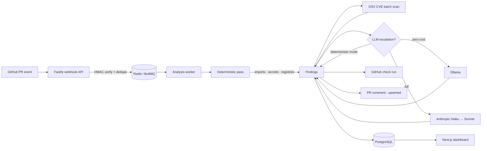

# Vouch — Technical Architecture Document

| | |
|---|---|
| **Status** | Live (v0.1, production) |
| **Last updated** | 2026-06-11 |
| **Companion docs** | [PRD](PRD.md) · [Security & Access](SECURITY-ACCESS.md) · [Frontend Spec](FRONTEND-SPEC.md) · [Tickets](TICKETS.md) · [Deployment](DEPLOYMENT.md) · [Operations](OPERATIONS.md) |

Vouch is a GitHub App that reviews pull requests for problems AI coding
assistants introduce: hallucinated packages, committed secrets, known CVEs, and
dependency bloat. This document explains how the pieces fit together and why
they're built the way they are.

## System overview

Three deployable units share one monorepo:

| Unit | Package | Role |
|------|---------|------|
| Webhook API | `apps/api` (`server.ts`) | Receives GitHub webhooks, verifies, enqueues |
| Analysis worker | `apps/api` (`worker.ts`) | Runs the pipeline, posts results |
| Dashboard | `apps/dashboard` | Triage UI: filter, inspect, dismiss findings |

`apps/api/all-in-one.ts` boots the API and worker in a single process — the
default image CMD and the shape used for free single-instance hosting. Under
load, deploy `server.js` and `worker.js` as separate services instead; the
queue decouples them already.

Shared logic lives in packages:

- **`@vouch/core`** — all analysis: parsers, registry clients, scanners, the
  LLM router, GitHub formatters. Pure logic, fully unit-tested, no Fastify or
  Next.js imports.
- **`@vouch/config`** — Zod-validated environment loading. Every process fails
  fast at boot with a readable list of missing variables instead of crashing
  mid-request.
- **`@vouch/types`** — shared TypeScript types (webhook payloads, findings).

## The webhook path

1. **Raw-body capture.** Fastify's default JSON parser consumes the body before
   HMAC verification can see it, so a custom content-type parser stores the raw
   string first (`middleware/raw-body.ts`).
2. **Signature verification.** `X-Hub-Signature-256` is recomputed with
   HMAC-SHA256 and compared via `crypto.timingSafeEqual`
   (`middleware/signature-verification.ts`). Requests without a valid signature
   never reach a handler.
3. **Idempotency.** GitHub delivery IDs are `SET NX`'d into Redis with a 1-hour
   TTL. Duplicates return 200 immediately. If processing *fails*, the key is
   released so a redelivery is processed rather than swallowed
   (`middleware/idempotency.ts`).
4. **Enqueue and return.** Qualifying `pull_request` events (`opened`,
   `synchronize`, `reopened`) create an `Analysis` row and enqueue a BullMQ job
   with exponential-backoff retries. The webhook responds in milliseconds;
   GitHub's 10-second delivery timeout is never in play.

A payload subtlety that only shows up in production: GitHub App deliveries
include the full `installation` object (with `account`) **only** on
`installation`/`installation_repositories` events. On `pull_request` events you
get `{ id }` alone, so the handler falls back to `repository.owner` for account
metadata.

## The analysis pipeline

The worker fetches the PR's changed files (patches only — **repositories are
never cloned**) and runs, in order:

### 1. Deterministic pass (always)

- **Import extraction.** TypeScript/JavaScript patches are parsed with the
  TypeScript compiler API; Python with tree-sitter. Only *added* lines are
  parsed (the diff is mapped to a synthetic source with line-number
  back-mapping), so pre-existing code is never re-flagged. Relative imports,
  tsconfig path aliases (`@/…`, `~/…`), and Node builtins are excluded.
- **Registry verification.** Every imported or newly-declared package is looked
  up on npm/PyPI. The client is tri-state: a **404 is proof** of a hallucinated
  package; a network error or 5xx means *unknown* and produces no finding. A
  registry outage can never block PRs with false positives. Python import
  aliases (`cv2` → `opencv-python`, `yaml` → `pyyaml`, …) are mapped before
  lookup. Lookups are cached (Redis in production, in-memory in tests).
- **Manifest fragment parsing.** Dependencies added to an *existing*
  package.json arrive as JSON fragments that `JSON.parse` rejects, so a
  line-level fallback extracts `"name": "range"` pairs. Protocol ranges
  (`workspace:`, `file:`, `link:`, `git+`, tarball URLs) are never
  registry-checked — they can't exist on npm by definition.
- **Secret scanning.** Twelve credential formats (AWS, GitHub, Anthropic,
  Stripe, Slack, Google, npm, GitLab, SendGrid, Twilio, private-key headers)
  plus an entropy heuristic, with placeholder filtering (`example`, `xxxx`,
  `your_…`).
- **Slop detection.** Redundant dependency groups (multiple HTTP clients),
  packages with native replacements (`uuid` → `crypto.randomUUID()`), and
  declared-but-never-imported packages, tunable per-repo via `vouch.json`.

### 2. OSV CVE scan (always)

Added dependencies with concrete versions are batch-queried against
[osv.dev](https://osv.dev). Advisories are **aggregated to one finding per
package** (axios@1.6.0 alone has 26 OSV entries — one row each would drown the
PR comment), reporting the highest severity and linking the top advisories.

### 3. LLM escalation (optional, never blocking)

`VOUCH_MODE` selects the tier:

| Mode | What runs | Cost |
|------|-----------|------|
| `deterministic` (default) | nothing — stages 1–2 only | $0 |
| `zero-cost` | local Ollama | $0 |
| `full` | Anthropic Haiku, low-confidence findings escalated to Sonnet | ~cents/PR |

The router enforces a hard rule: **any LLM failure degrades to deterministic
findings.** Timeouts, rate limits, and malformed responses are logged and
swallowed. The check run never fails because a model did.

### 4. Output

- **Check run** — `action_required` for security/hallucination findings,
  `neutral` for advisory-only, `success` when clean.
- **PR comment** — a single comment carrying a hidden marker
  (`<!-- vouch:analysis-comment -->`). Subsequent pushes update it in place
  instead of stacking new comments. Zero findings → no comment at all.
- **Database** — findings are written transactionally
  (delete-previous-then-createMany), so BullMQ retries are idempotent.

## Data model

Five tables (see `prisma/schema.prisma`):

`Installation 1—n Repo 1—n Analysis 1—n Finding`, plus `UsageRecord` for
per-installation daily rollups. `Finding` carries location (`filePath`,
`lineStart`), classification (`type`, `severity`, `confidence`), and triage
state (`status`, `dismissedBy`, `dismissedAt`).

## Dashboard

Next.js 14 App Router. Server components query Postgres directly via Prisma —
there is no REST hop between dashboard and database. Sign-in is GitHub OAuth
(via the same GitHub App's client ID), gated by `DASHBOARD_ALLOWED_LOGINS`;
in production an empty allowlist rejects everyone, because findings contain
code snippets from private repositories. Dismissal is a server action with an
optimistic UI update.

`DASHBOARD_DEMO_MODE=true` bypasses auth **only** when `NODE_ENV` is not
production — it exists so `pnpm demo` works without creating an OAuth app, and
it is structurally impossible to enable on a deployed build.

## Security posture

- HMAC-verified webhooks, constant-time comparison
- Replay protection via Redis delivery-ID dedupe
- Admin API (`/api/v1`) returns 503 unless `ADMIN_API_TOKEN` is configured,
  then requires a constant-time-compared Bearer token
- No repo checkout; only PR patches via the GitHub API
- Package *names* (never code) sent to registries and OSV
- LLM mode is opt-in; `deterministic` and `zero-cost` keep diffs entirely
  on your infrastructure

## Design decisions worth knowing

1. **Deterministic-first, LLM-last.** A registry 404 or a CVE ID is evidence a
   reviewer can verify in one click. Model opinions are reserved for what
   static analysis can't see, and are never allowed to block.
2. **Analyze the diff, not the repo.** Findings stay scoped to what the PR
   changed, analysis is fast (seconds), and no customer code is stored beyond
   short snippets attached to findings.
3. **Fail open on infrastructure, fail closed on auth.** Registry/OSV/LLM
   failures degrade silently; missing auth configuration denies access.
4. **One process by default.** The all-in-one entry keeps hosting free and
   operations simple; the queue boundary means splitting into two services is
   a deploy-time decision, not a code change.
